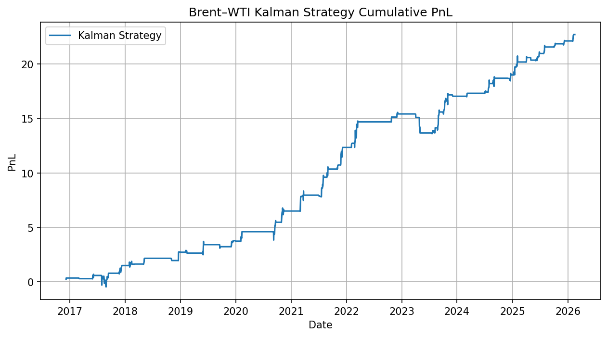
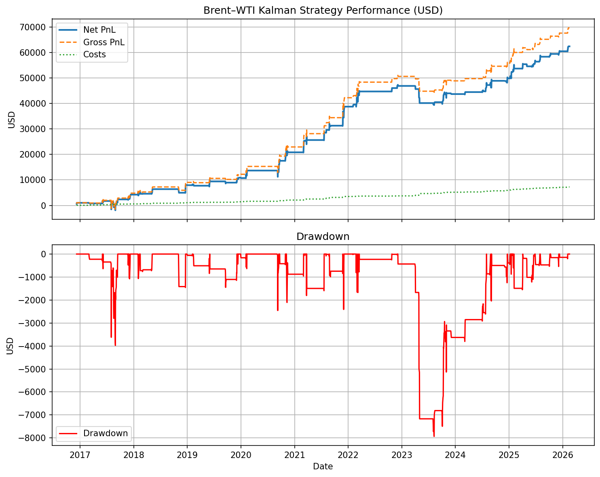

# Cross-Market Commodity Spread Trading

A systematic study of statistical arbitrage strategies across energy markets, focusing on **Henry Hub–TTF gas** and **Brent–WTI crude oil** spreads.

---

## 🧠 Overview

This project builds and evaluates a full pipeline for spread trading:
Market Data -> Hedge Ratio Estimation -> Signal Generation -> Risk Filtering -> Execution -> Evaluation


Key techniques:
- Cointegration / rolling regression
- State-space (Kalman) hedge ratio
- Z-score mean-reversion
- Volatility scaling
- Regime filtering
- Walk-forward backtesting

---

## 📊 Key Results

| Model | Sharpe | Max DD | Notes |
|------|--------|--------|------|
| HH–TTF Rolling Beta | 0.37 | -28.12 | Unstable hedge ratio, weak walk-forward robustness |
| HH–TTF + ML Filter | 0.39 | N/A | Walk-forward ML filter not robust |
| Brent–WTI Baseline | 0.33 | -59.05 | Stable but weak |
| Brent–WTI Production OLS | 0.70 | -1.96 | Controlled risk |
| *Brent–WTI Kalman* | *1.43* | *-1.95* | Adaptive + robust |
| **Brent–WTI Kalman (USD, walk-forward)** | **1.24** | **-12.7% (DD/PnL)** | Adaptive hedge ratio, contract-level sizing, after costs |

---

## 🔍 Models & Methodologies

---

### Henry Hub – TTF (Rolling Beta Baseline)

#### Methodology
- Cross-market gas spread (US vs Europe)
- FX + unit normalization
- Rolling OLS hedge ratio
- Z-score mean-reversion
- Walk-forward evaluation

#### Results
- Strong long-term relationship
- **Highly unstable hedge ratio**
- Poor out-of-sample performance
- Large drawdowns

---

### Henry Hub – TTF (ML Filtered Strategy)

#### Methodology
- Logistic regression filters trades
- Features:
  - Z-score lags
  - residual momentum
  - volatility ratios
  - hedge ratio dynamics
- Train-only calibration

#### Results
- Improves selectivity in-sample
- **Fails under walk-forward**
- Sensitive to regime shifts

---

### Brent – WTI (Rolling Beta Baseline)

#### Methodology
- Crude oil spread (global vs US benchmark)
- Direct spread / beta ≈ 1
- Z-score signal

#### Results
- Stable hedge ratio
- Weak mean-reversion signal
- High drawdown without controls

---

### Brent – WTI (Production Walk-Forward, OLS)

#### Methodology
- Train-only hedge ratio estimation
- Lagged signal execution (no look-ahead)
- Volatility-based position sizing
- Regime filtering
- Transaction costs included

#### Results
- Sharpe ~0.7
- Strong drawdown control
- Low-frequency, selective trading

---

### ⭐ Brent – WTI (Kalman Production Walk-Forward)

#### Methodology
- **State-space hedge ratio (Kalman filter)**
- Adaptive alpha and beta estimation
- Grid search of Kalman parameters (delta, R) on train only
- Volatility scaling + regime gating
- Walk-forward:
  - train → calibrate → freeze → test
- Fully lagged execution

## ⚙️ Pipeline

Prices → Kalman Filter → Residual → Z-score → Regime Filter → Position → PnL

#### Results
- Sharpe: **1.43**
- Max drawdown: **-1.95**
- Average trades per split: ~8
- ~13% of periods with no trades
- Median split Sharpe (active periods): ~2.8

---

> The strategy exhibits strong performance in periods where sufficient trading opportunities exist (median split Sharpe ~2.8), but activity is sparse, with ~13% of periods producing no trades.

---

## 📈 Strategy Performance



---

## 💰 From Model Units to Real Trading PnL

Up to this point, strategy performance is expressed in **spread units**, where PnL reflects changes in the residual (Brent − β·WTI) scaled by a unitless position. While this is sufficient to evaluate signal quality (e.g., Sharpe ratio), it does not correspond to real-world profitability.

To make the strategy **deployable**, the model is converted into a **contract-level implementation**:

- Positions are expressed in **futures contracts** (Brent and WTI), using standard contract sizes (~1000 barrels per contract)
- The hedge ratio (β) determines the relative number of contracts in each leg
- Residual changes (in $/barrel) are mapped to **USD PnL** via contract multipliers
- Position sizing is scaled to a **target daily risk budget** (e.g., $1,000), ensuring consistent exposure across time
- Transaction costs are incorporated as **per-contract costs**, approximating bid-ask spreads and execution slippage

This conversion allows the strategy to be evaluated in **real monetary terms**, including:
- Net PnL in USD
- Drawdown in USD
- Cost impact on returns
- Position sizes and turnover

### USD Results (Contract-Level Implementation)

#### Results
- Sharpe: **1.24**
- Net PnL: **$62.4k**
- Max drawdown: **-$7.93k**
- Drawdown / PnL: **12.7%**
- Gross PnL: **$69.6k**
- Total costs: **$7.24k**

---

## 📈 Strategy Performance




---

## ⏱️ Backtesting Framework

All strategies are evaluated using a **walk-forward methodology**:

- Training window: **~2 years (504 trading days)**
- Test (live) window: **~3 months (63 trading days)**
- Rolling evaluation across ~9 years of data

Each model is:
1. Calibrated on the training window  
2. Frozen  
3. Applied to the next test period  

This avoids look-ahead bias and mimics real deployment conditions.

---

## 🚀 How to Run

```powershell
# Download data
python -m src.data.download_data

# Prepare datasets
python -m src.data.prepare_data
python -m src.data.prepare_brent_wti

# Run production Kalman model
python -m src.backtest.brent_wti_kalman_production_walkforward